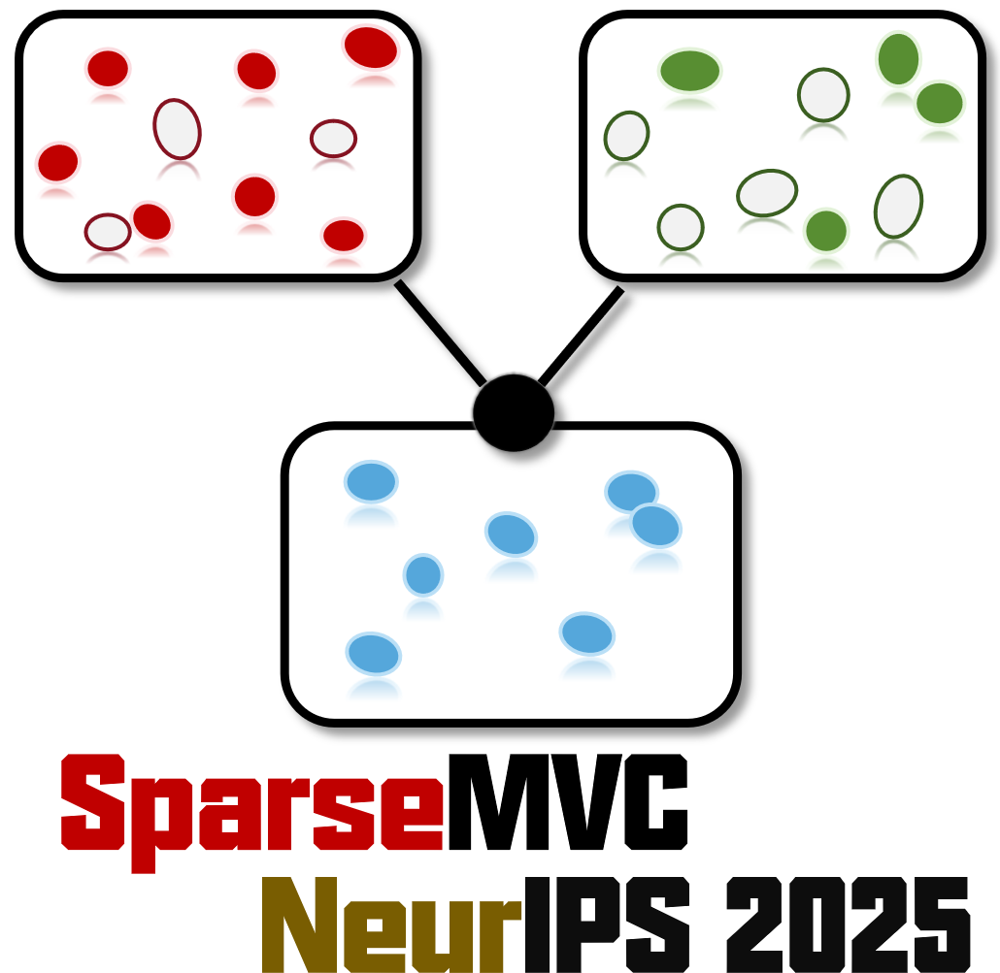
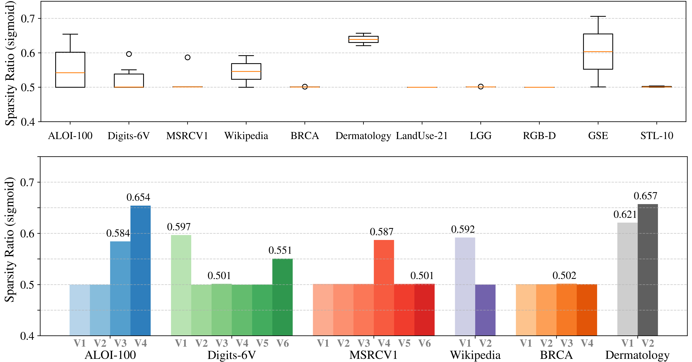
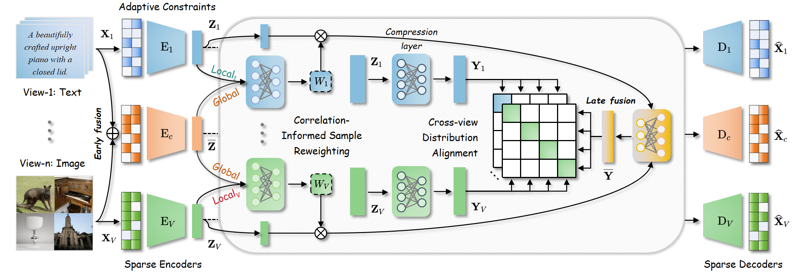
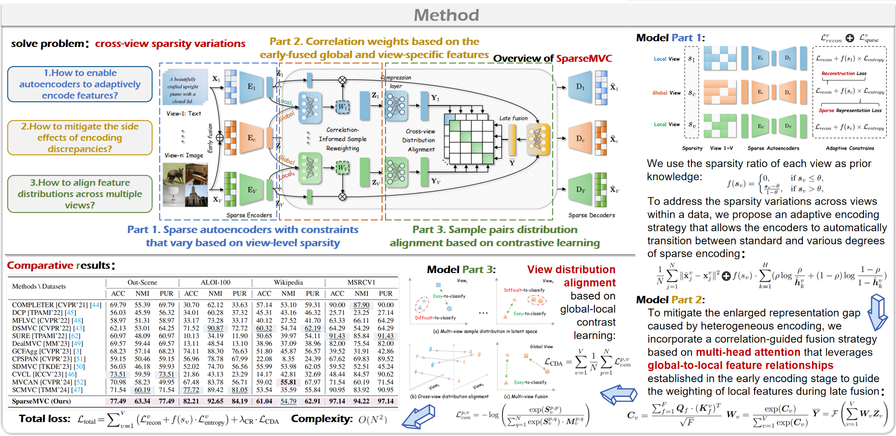

**[NeurIPS 2025 ✨Spotlight]**  **SparseMVC: Probing Cross-view Sparsity Variations for Multi-view Clustering** 🚀

## 1.📑Introduction

> **SparseMVC: Probing Cross-view Sparsity Variations for Multi-view Clustering**
> 📚[Paper](https://www.kdocs.cn/l/cj6CUBIYQdiK)[[PDF](https://github.com/cleste-pome/SparseMVC/releases/download/Slides/SparseMVC_NeurIPS2025_Paper.pdf)] 🌐[NeurIPS](https://neurips.cc/virtual/2025/poster/117045)
>
> Authors: [Ruimeng Liu](https://github.com/cleste-pome), [Xin Zou](https://github.com/obananas), [Chang Tang](https://github.com/ChangTang), Xiao Zheng, Xingchen Hu, Kun Sun, Xinwang Liu
>
> More details can be found in the 🎞️[slides](https://github.com/cleste-pome/SparseMVC/releases/download/Slides/SparseMVC_PPT2PDF.pdf) and 📰[poster](https://github.com/cleste-pome/SparseMVC/releases/download/Slides/SparseMVC_Poster.png).
> 

I have attempted to build a training framework for multi-view learning (the clustering part has already been completed). It includes functionalities such as reading datasets (.mat), data processing (with noise, missing data, and misalignment), replaceable network construction modules, loss functions, training data saving, visualization, and various other analytical utilities. You are welcome to use and reference it (papers are on road).(｡･∀･)ﾉﾞ

Just getting started, to be continued.

ps. 我给所有核心代码加了详细的中文注释。说中文的兄弟姐妹们我懂你们，咱们作为非英语母语者在面对新研究领域的项目时太不容易了，因此我尽我所能给我的MVC开源项目加上了中文注释（毕竟我也是经历过看懂论文却看不懂代码复现不了项目的痛苦），希望能帮到屏幕对面的你！



Our approach focuses on view-level structural sparsity, specifically the sparsity variation across different views within the same multi-view sample. This differs from data-level sparsity methods that typically apply uniform sparse encoding across all views without considering inter-view heterogeneity. To address sparsity variation, we proposed SparseMVC, which leverages an adaptive encoding strategy that uses the sparsity ratio of each view as prior knowledge, enabling the encoder to switch between standard and sparse forms with appropriate constraint strengths. Additionally, we introduce a series of interdependent mechanisms to mitigate the side effects of representational divergence caused by non-uniform encoding. Specifically, a correlation-guided fusion strategy leverages global-to-local feature relationships from the early stages to guide the weighting of local features in late fusion. Moreover, a distribution alignment module structurally constrains the fused representations, enhancing cross-view complementarity in the final stage. Comprehensive experiments and detailed dissections of each module validate the efficacy of SparseMVC. We hope this work inspires greater attention to the intrinsic characteristics of data and to the design of architectures driven by data.

## 2.🕸️SparseMVC

Sparsity ratios across views in multi-view datasets. Top box plot illustrates the sparsity ratio distribution, which shows the median (orange line), interquartile range (box), and any outliers (points outside the whiskers). Bottom bar plot presents the sparsity ratios for each view within each dataset. The sparsity ratios in Figure are transformed using the sigmoid function, shifting the baseline from 0 (the bottom of the image) to 0.5 (the middle of the image) for better visualization.


Overview of SparseMVC, a framework designed to address varying sparsity across views.


SparseMVC incorporates Sparse Autoencoder with Adaptive Constraints, Correlation-Informed Sample Reweighting, and Cross-view Distribution Alignment.


Convergence analysis of the training process. The left area of the vertical black dashed line represents the pre-training phase, while the right area stands for the view alignment training process.

## 3.💻User Guide

Multi-View Clustering Code Framework

 **⚙️Requirements**

- python==3.8.15

- pytorch==1.12.0

- numpy==1.21.6

- scikit-learn==1.0

- scipy==1.10.1

### 3.1 Simple and seamless data loading

Simply package the dataset in .mat format and place it in the "datasets" folder to enable one-click training for all datasets, regardless of the number of views.

### 3.2 Data processing

```python
# 选取noise ratio比例的样本，随机(1到view-1)个视图做添加高斯噪声处理 (Select samples with a noise ratio, and randomly apply Gaussian noise processing to (1 to view-1) views)
parser.add_argument('--noise_ratio', type=float, default=0.0)
# 选取conflict ratio比例的样本，随机选择一个视图的数据用另一个类别的样本的同视图数据替换 (Select samples with a conflict ratio, and randomly choose data from one view to replace it with the same view data from a sample of another category)
parser.add_argument('--conflict_ratio', type=float, default=0.0)
# 选取missing ratio比例样本的随机(1到view-1)个视图做缺失处理 (Select samples with a missing ratio, and randomly apply missing data processing to (1 to view-1) views)
parser.add_argument('--missing_ratio', type=float, default=0.0)
# 选取sparsity ratio比例维度的随机(1到dims-1)个维度做置0处理 (Select dimensions with a sparsity ratio, and randomly apply zeroing to (1 to dims-1) dimensions)
parser.add_argument('--sparsity_ratio', type=float, default=0.0)
```

### 3.3 Hype parameters

```python
parser.add_argument('--batch_size', default=256, type=int)
parser.add_argument("--learning_rate", default=0.0003)
parser.add_argument("--pre_epochs", default=300)  
parser.add_argument("--con_epochs", default=300)  
parser.add_argument("--iter", default=1)
parser.add_argument("--feature_dim", default=64)
parser.add_argument("--high_feature_dim", default=20)
parser.add_argument("--seed", default=50)
parser.add_argument("--weight_decay", default=0.0)
```

### 3.4 📈Visualization of the training process and automatic data storage

The system automatically saves 

1. logs: training information (Facilitate manual review);
2. images: the change curve of evaluation metrics during the training process;
3. CSV files: metrics information (Facilitate subsequent plotting and reading);
4. models: network weight file in pt format. 

It dynamically displays the evaluation metrics and loss changes for each view during training. After training is completed, it generates line plots for the loss function and evaluation metrics.

```bash
 30%|██▉       | 89/300 [21:44<08:51,  2.52s/it]Con Epochs[389] Loss:16.679317
Sparsity ratio(zero(missing)_value(dims)_proportion mean)[view]:[0.0001, 0.0001, 0.3415, 0.6383]

 30%|███       | 90/300 [24:21<2:51:13, 48.92s/it]Con Epochs[390] Loss:16.677748
Sparsity ratio(zero(missing)_value(dims)_proportion mean)[view]:[0.0001, 0.0001, 0.3415, 0.6383]

Con-train: SAA+CSR+CDA

Late-fused Feature Clustering
+------------+--------+--------+--------+----------+
| Feature    |    ACC |    NMI |    ARI |   Purity |
+============+========+========+========+==========+
| View 1     | 0.4063 | 0.6290 | 0.2830 |   0.4392 |
+------------+--------+--------+--------+----------+
| View 2     | 0.3730 | 0.6155 | 0.2562 |   0.4012 |
+------------+--------+--------+--------+----------+
| View 3     | 0.5052 | 0.6727 | 0.3628 |   0.5235 |
+------------+--------+--------+--------+----------+
| View 4     | 0.4739 | 0.6509 | 0.3437 |   0.4997 |
+------------+--------+--------+--------+----------+
| Global (Y) | 0.7216 | 0.8175 | 0.5998 |   0.7358 |
+------------+--------+--------+--------+----------+
```

## 4. 🙏Acknowledgments

Our proposed SparseMVC draws inspiration from the works of [SCMVC](https://github.com/SongwuJob/SCMVC),  [SDMVC](https://github.com/SubmissionsIn/SDMVC), [MVCAN](https://github.com/SubmissionsIn/MVCAN) and [CPSPAN](https://github.com/jinjiaqi1998/CPSPAN). We would like to thank the authors for their valuable contributions. I would also like to thank my colleagues Xiao He and Zhenglai Li for their valuable guidance.

## 5.Citation

If you use our code framework or get inspired by our work (hopefully as a positive example, but if it’s a negative example, that's fine too(*≧ω≦)), please cite our paper! 

```latex
@article{liu2025sparsemvc,
  title={SparseMVC: Probing Cross-view Sparsity Variations for Multi-view Clustering},
  author={Ruimeng Liu and Xin Zou and Chang Tang and Xiao Zheng and Xingchen Hu and Kun Sun and Xinwang Liu},
  journal={Advances in neural information processing systems},
  volume={},
  pages={},
  year={2025}
}
```


[](https://www.star-history.com/#cleste-pome/SparseMVC&type=date&legend=top-left)

📎Copyright link：https://github.com/cleste-pome/SparseMVC


