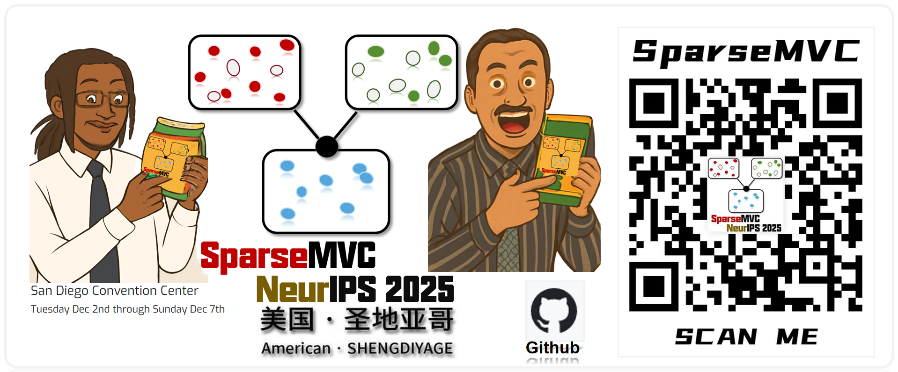
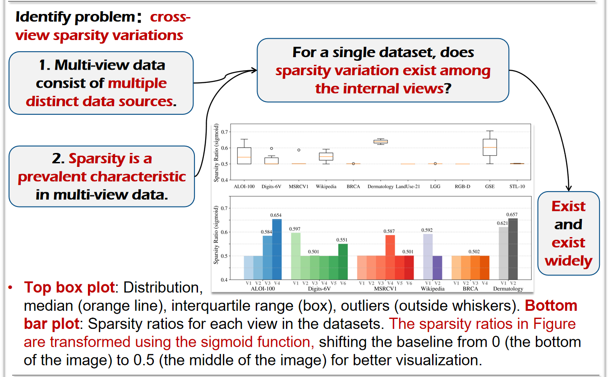
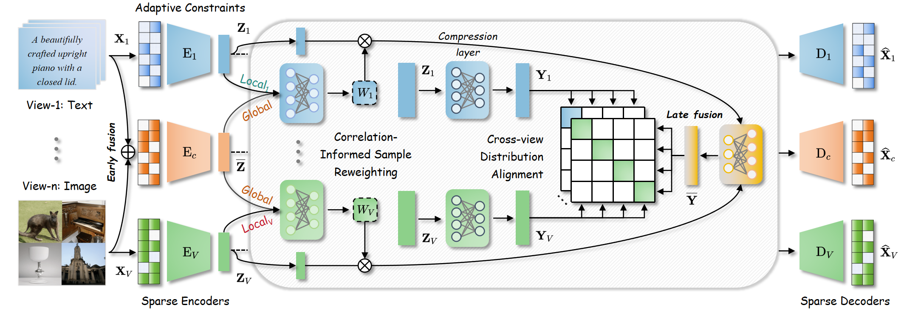
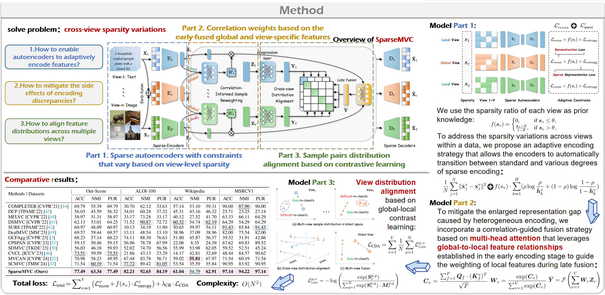
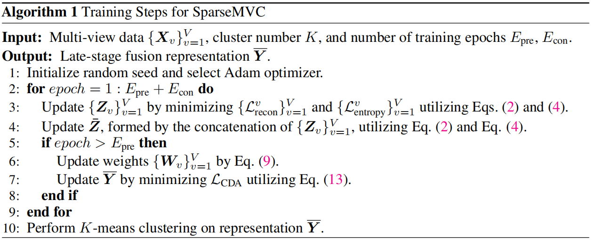
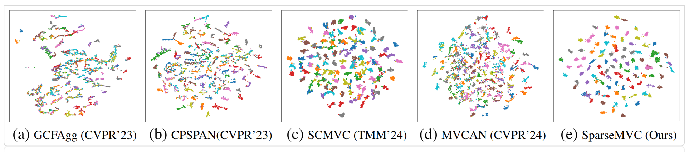
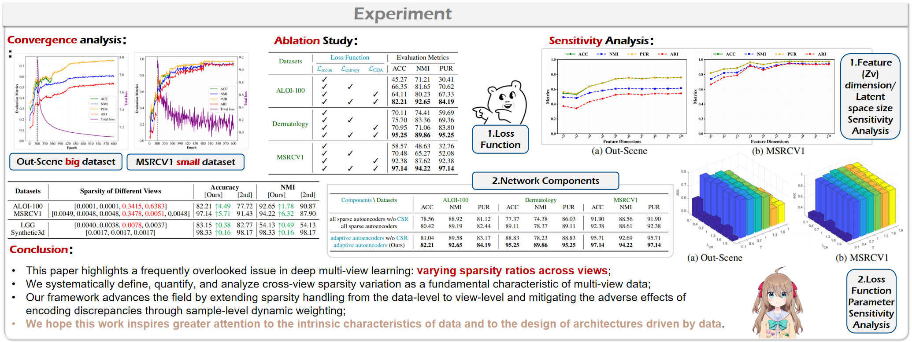

## **[NeurIPS 2025 ✨Spotlight]**  **SparseMVC: Probing Cross-view Sparsity Variations for Multi-view Clustering** 🚀

## 1.📑Introduction

> **SparseMVC: Probing Cross-view Sparsity Variations for Multi-view Clustering**
> 📚[Paper](https://openreview.net/pdf?id=cvJvk6oYfC)[[PDF](https://github.com/cleste-pome/SparseMVC/releases/download/Materials/SparseMVC_NeurIPS2025_Paper.pdf)] 🌐[NeurIPS](https://neurips.cc/virtual/2025/loc/san-diego/poster/117045)
>
> Authors: [Ruimeng Liu](https://github.com/cleste-pome), [Xin Zou](https://github.com/obananas), [Chang Tang](https://github.com/ChangTang), Xiao Zheng, Xingchen Hu, Kun Sun, Xinwang Liu
>
> More details can be found in the 🎞️[slides](https://github.com/cleste-pome/SparseMVC/releases/download/Materials/SparseMVC_PPT2PDF.pdf) and 📰[poster](https://github.com/cleste-pome/SparseMVC/releases/download/Materials/SparseMVC_Poster.png).
> 

Before these papers, I have attempted to build a training framework for multi-view learning (the clustering part has already been completed). It includes functionalities such as reading datasets (.mat), data processing (with noise, missing data, and misalignment), replaceable network construction modules, loss functions, training data saving, visualization, and various other analytical utilities. You are welcome to use and reference it (papers are on road).(｡･∀･)ﾉﾞ

Just getting started, to be continued.

ps. 我给所有核心代码加了详细的中文注释。说中文的兄弟姐妹们我懂你们，咱们作为非英语母语者在面对新研究领域的项目时太不容易了，因此我尽我所能给我的MVC开源项目加上了中文注释（毕竟我也是经历过看懂论文却看不懂代码复现不了项目的痛苦），希望能帮到屏幕对面的你！我深知我的的论文写作比不上大牛，所以我尝试在开源代码和配套上去弥补，让大伙在读起来和用起来爽上至少取其一，起到抛砖引玉的效果，谢谢屏幕对面的你能读我的论文用我的代码😊

ps. I've added detailed Chinese comments to all the core code. To my fellow Chinese speakers—I get it! As non-native English speakers, we face unique challenges when diving into projects in new research fields. That’s why I went out of my way to include Chinese annotations in my open-source MVC project (after all, I’ve been there too—understanding the paper but struggling to parse the code and reproduce the project). I hope this helps you, whoever you are reading this! I’m fully aware my paper writing doesn’t measure up to that of top researchers. So I’ve tried to make up for it with the open-source code and supporting materials—aiming to make either reading or using them a smooth experience, if not both. My work is meant to serve as a modest foundation to inspire better solutions. Thank you for reading my paper and using my code 😊

<p align="center">
  
</p>

Our approach focuses on view-level structural sparsity, specifically the sparsity variation across different views within the same multi-view sample. This differs from data-level sparsity methods that typically apply uniform sparse encoding across all views without considering inter-view heterogeneity. To address sparsity variation, we proposed SparseMVC, which leverages an adaptive encoding strategy that uses the sparsity ratio of each view as prior knowledge, enabling the encoder to switch between standard and sparse forms with appropriate constraint strengths. Additionally, we introduce a series of interdependent mechanisms to mitigate the side effects of representational divergence caused by non-uniform encoding. Specifically, a correlation-guided fusion strategy leverages global-to-local feature relationships from the early stages to guide the weighting of local features in late fusion. Moreover, a distribution alignment module structurally constrains the fused representations, enhancing cross-view complementarity in the final stage. Comprehensive experiments and detailed dissections of each module validate the efficacy of SparseMVC. We hope this work inspires greater attention to the intrinsic characteristics of data and to the design of architectures driven by data.

## 2.🕸️SparseMVC

Multi-view clustering：Multi-view refers to data composed of multiple views from distinct sources. Clustering, which emphasizes unsupervised learning, essentially treats clustering algorithms as probes to assess the representation quality of the features extracted by the network.

<p align="center">

</p>

We explicitly identify, analyze, and define the problem of cross-view sparsity variations in multi-view data, and to propose a dedicated framework SparseMVC that offers a targeted and principled solution.

<p align="center">

</p>

Overview of SparseMVC (Adaptive Sparse Autoencoders for Multi-View Clustering), a framework with three key modules. Initially, the sparse autoencoder probes the sparsity of each view and adaptively adjusts encoding formats via an entropymatching loss term, mitigating cross-view inconsistencies. Subsequently, the correlation-informed sample reweighting module employs attention mechanisms to assign weights by capturing correlations between early-fused global and viewspecific features, reducing encoding discrepancies and balancing contributions. Furthermore, the cross-view distribution alignment module aligns feature distributions during the late fusion stage, accommodating datasets with an arbitrary number of views.

<p align="center">

</p>

SparseMVC incorporates Sparse Autoencoder with Adaptive Constraints, Correlation-Informed Sample Reweighting, and Cross-view Distribution Alignment.

<p align="center">

</p>

<p align="center">

</p>

T-SNE visualization of the features learned with recently comparative methods (a-d) and ours (e) on the ALOI-100 dataset.

<p align="center">
  
</p>

All experiments were conducted using Python 3.8.15 and PyTorch 1.13.1+cu116 on a Windows PC equipped with an AMD Ryzen 9 5900HX CPU, 32GB RAM, and an Nvidia RTX 3080 GPU (16GB). 

Limitations: (1) SparseMVC does not incorporate a targeted design or specialized mechanisms to address view misalignment and random view missingness.
(2) The use of contrastive learning inherently introduces computational overhead, making it unlikely to rank among the fastest available approaches.


## 3.💻User Guide

Multi-View Clustering Code Framework

 **⚙️Requirements**

- python==3.8.15

- pytorch==1.13.1
  
- numpy==1.21.6

- scikit-learn==1.0

- scipy==1.10.1

### 3.1 Simple and seamless data loading

Simply package the dataset in .mat format and place it in the "datasets" folder to enable one-click training for all datasets, regardless of the number of views.

### 3.2 Data processing

```python
# 选取noise ratio比例的样本，随机(1到view-1)个视图做添加高斯噪声处理 (Select samples with a noise ratio, and randomly apply Gaussian noise processing to (1 to view-1) views)
parser.add_argument('--noise_ratio', type=float, default=0.0)
# 选取conflict ratio比例的样本，随机选择一个视图的数据用另一个类别的样本的同视图数据替换 (Select samples with a conflict ratio, and randomly choose data from one view to replace it with the same view data from a sample of another category)
parser.add_argument('--conflict_ratio', type=float, default=0.0)
# 选取missing ratio比例样本的随机(1到view-1)个视图做缺失处理 (Select samples with a missing ratio, and randomly apply missing data processing to (1 to view-1) views)
parser.add_argument('--missing_ratio', type=float, default=0.0)
# 选取sparsity ratio比例维度的随机(1到dims-1)个维度做置0处理 (Select dimensions with a sparsity ratio, and randomly apply zeroing to (1 to dims-1) dimensions)
parser.add_argument('--sparsity_ratio', type=float, default=0.0)
```

### 3.3 Hype parameters

```python
parser.add_argument('--batch_size', default=256, type=int)
parser.add_argument("--learning_rate", default=0.0003)
parser.add_argument("--pre_epochs", default=300)  
parser.add_argument("--con_epochs", default=300)  
parser.add_argument("--iter", default=1)
parser.add_argument("--feature_dim", default=64)
parser.add_argument("--high_feature_dim", default=20)
parser.add_argument("--seed", default=50)
parser.add_argument("--weight_decay", default=0.0)
```

### 3.4 📈Visualization of the training process and automatic data storage

The system automatically saves 

1. logs: training information (Facilitate manual review);
2. images: the change curve of evaluation metrics during the training process;
3. CSV files: metrics information (Facilitate subsequent plotting and reading);
4. models: network weight file in pt format. 

It dynamically displays the evaluation metrics and loss changes for each view during training. After training is completed, it generates line plots for the loss function and evaluation metrics.

```bash
 30%|██▉       | 89/300 [21:44<08:51,  2.52s/it]Con Epochs[389] Loss:16.679317
Sparsity ratio(zero(missing)_value(dims)_proportion mean)[view]:[0.0001, 0.0001, 0.3415, 0.6383]

 30%|███       | 90/300 [24:21<2:51:13, 48.92s/it]Con Epochs[390] Loss:16.677748
Sparsity ratio(zero(missing)_value(dims)_proportion mean)[view]:[0.0001, 0.0001, 0.3415, 0.6383]

Con-train: SAA+CSR+CDA

Late-fused Feature Clustering
+------------+--------+--------+--------+----------+
| Feature    |    ACC |    NMI |    ARI |   Purity |
+============+========+========+========+==========+
| View 1     | 0.4063 | 0.6290 | 0.2830 |   0.4392 |
+------------+--------+--------+--------+----------+
| View 2     | 0.3730 | 0.6155 | 0.2562 |   0.4012 |
+------------+--------+--------+--------+----------+
| View 3     | 0.5052 | 0.6727 | 0.3628 |   0.5235 |
+------------+--------+--------+--------+----------+
| View 4     | 0.4739 | 0.6509 | 0.3437 |   0.4997 |
+------------+--------+--------+--------+----------+
| Global (Y) | 0.7216 | 0.8175 | 0.5998 |   0.7358 |
+------------+--------+--------+--------+----------+
```

## 4. 🙏Acknowledgments

Our proposed SparseMVC draws inspiration from the works of [SCMVC](https://github.com/SongwuJob/SCMVC),  [SDMVC](https://github.com/SubmissionsIn/SDMVC), [MVCAN](https://github.com/SubmissionsIn/MVCAN) and [CPSPAN](https://github.com/jinjiaqi1998/CPSPAN). We would like to thank the authors for their valuable contributions. I would also like to thank my colleagues Zhenglai Li and Xiao He for their valuable guidance.

## 5. 📚Citation

If you use our code framework or get inspired by our work (hopefully as a positive example, but if it’s a negative example, that's fine too(*≧ω≦)), please cite our paper! 

```bibtex
@article{liu2025sparsemvc,
  title={SparseMVC: Probing Cross-view Sparsity Variations for Multi-view Clustering},
  author={Ruimeng Liu and Xin Zou and Chang Tang and Xiao Zheng and Xingchen Hu and Kun Sun and Xinwang Liu},
  journal={Advances in neural information processing systems},
  volume={},
  pages={},
  year={2025}
}
```


[](https://www.star-history.com/#cleste-pome/SparseMVC&type=date&legend=top-left)

📎Copyright link：https://github.com/cleste-pome/SparseMVC


